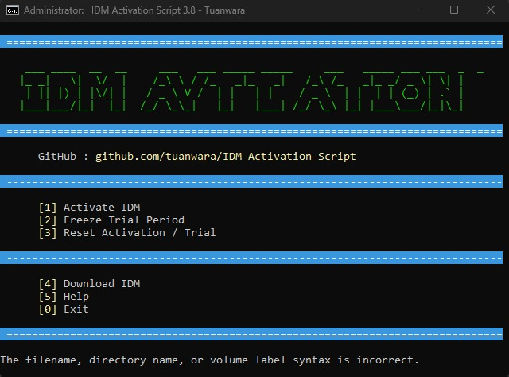

# IDM Activation Script - Tuanwara Edition



  

A customized, futuristic version of the popular Windows batch script for activating Internet Download Manager (IDM). This edition features a **Cyber Neon** interface, optimized code, and error-free execution.

## ✨ New Features in Tuanwara Edition

- **🎨 Cyber Neon Interface**: A completely redesigned UI using Cyan, Green, and Magenta colors for a modern hacker-style aesthetic.
- **🚀 Optimized Core**: Removed strict LF line-ending checks to prevent common crash errors on different text editors.
- **🛡️ Safe ASCII Rendering**: Improved method for displaying ASCII art using variable expansion to prevent syntax errors.
- **⚡ Version 3.8**: Updated core logic for better compatibility.

## 🔧 Core Features

- **Multiple Activation Methods**
  - Full IDM Activation
  - Trial Period Freeze (Recommended)
  - Reset Activation/Trial
- **Advanced Capabilities**
  - Automatic registry backup before modifications
  - Smart CLSID registry key detection
  - Support for x86, x64, and ARM64 architectures
  - Unattended mode support

## Requirements

- Windows 7 or later (Windows 10/11 Recommended)
- Administrator privileges
- Internet Download Manager installed

## 🚀 Usage

### Method 1: Manual Run (Recommended)

1. Download the repository or the `IAS_Tuanwara.cmd` file.
2. Right-click on **`IAS_Tuanwara.cmd`** and select **"Run as administrator"**.
3. Enjoy the new interface and choose from the menu:
   - `[1]` Activate IDM
   - `[2]` Freeze Trial Period (Recommended)
   - `[3]` Reset Activation/Trial
   - `[4]` Download IDM
   - `[5]` Help
   - `[0]` Exit

### Method 2: Command Line Mode

You can run the script with arguments for automation:

```batch
# Activate IDM
IAS_Tuanwara.cmd /act

# Freeze trial period
IAS_Tuanwara.cmd /frz

# Reset activation
IAS_Tuanwara.cmd /res
```
### ⚙️ How It Works

- **Registry Backup**: Creates automatic backups in `%SystemRoot%\Temp`.
- **Registry Scan**: Intelligently detects IDM-related registry keys.
- **Execution**: Applies the selected operation (Activate/Freeze/Reset).
- **Visuals**: Displays the status in a clean, color-coded terminal window.

### Recommendations

- **Freeze Trial** is recommended over activation for the best long-term stability (no fake serial popups).
- Always run with administrator privileges.
- Ensure IDM is closed before running the script (the script will attempt to close it automatically).

### Troubleshooting

**Script crashes immediately?** This edition fixes the "LF line ending" error. Ensure you are using `IAS_Tuanwara.cmd`.

**"Windows protected your PC"** popup? Click "More info" > "Run anyway". This is common for batch scripts not signed by Microsoft.

**PowerShell restriction error?** The script attempts to bypass restrictions, but if it fails, run this in PowerShell as Admin:

```batch
# PowerShell
Set-ExecutionPolicy -Scope CurrentUser -ExecutionPolicy Bypass
```

## Compatibility

| Windows Version | Support |
|----------------|---------|
| Windows 11     | ✅ Full |
| Windows 10     | ✅ Full |
| Windows 7      | ✅ Full |
| Windows Server | ✅ Full |

## Download IDM

Official IDM Download: [internetdownloadmanager.com](https://www.internetdownloadmanager.com/download.html)

## Version History

**v3.8 - Tuanwara Edition**

- **UI**: Implemented Cyber Neon theme (Cyan/Green/Magenta).
- **Fix**: Replaced direct ASCII echo with variable delayed expansion to fix syntax crashes.
- **Fix**: Removed "LF line ending" checker for easier editing.
- **Update**: Bumped version to 3.8.

## Disclaimer

This script is for **educational purposes only**. Users should purchase a legitimate license from the official [Internet Download Manager](https://www.internetdownloadmanager.com/download.html) website to support the developers.

## License

This project is released under the [MIT License](LICENSE).

## Author

**Tuanwara**
- GitHub: [@tuanwara](https://github.com/tuanwara)
